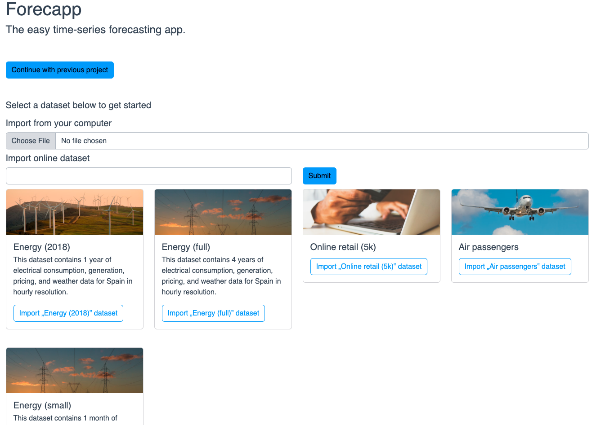
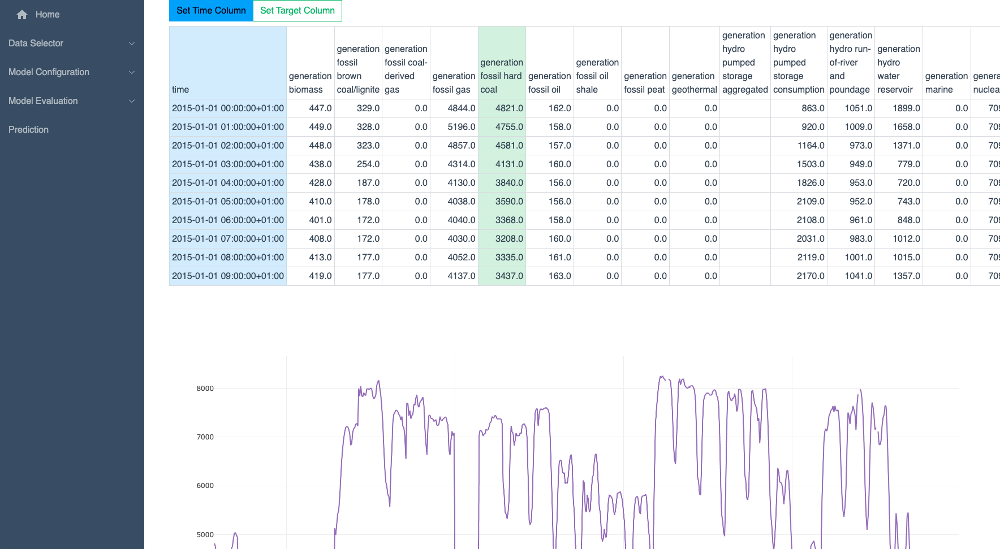
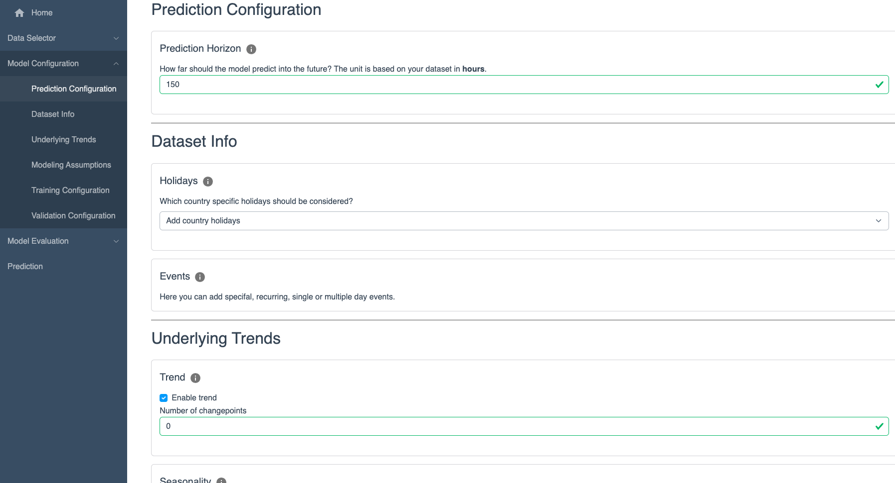
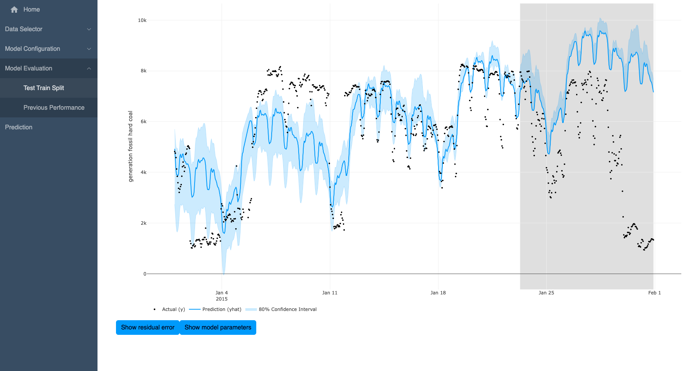

# Forecapp Overview

Forecapp is a web app that enables easy, no-code time series forecasting. In the backend it is based on the [NeuralProphet](https://neuralprophet.com/) framework for explainable time-series forecasting.

## Pages

### Home Screen

The home screen allows the user to either upload their own time series dataset as a .csv file, or to choose a sample dataset to try out forecapp.

### Data Selector

The data selector screen allows the user to choose the dataset columns that should be used for time and prediction. To give more clarity in the process, the page gives an overview of the parsed dataset as well as a plot with the selected time and prediction value.

### Model Configuration

The model configuration screen allows the user to configure key parameters of the time-series prediction model. The configuration is broken down into different sub-categories which group model parameters.

### Model Evaluation

The model evaluation screen gives the user tools to validate their prediction model using train/test split.

### Prediction

The prediction screen output the future prediction of a model iteration selected by thes user. In addition to showing the prediction, it also allows to extract the prediction as well as the model.
